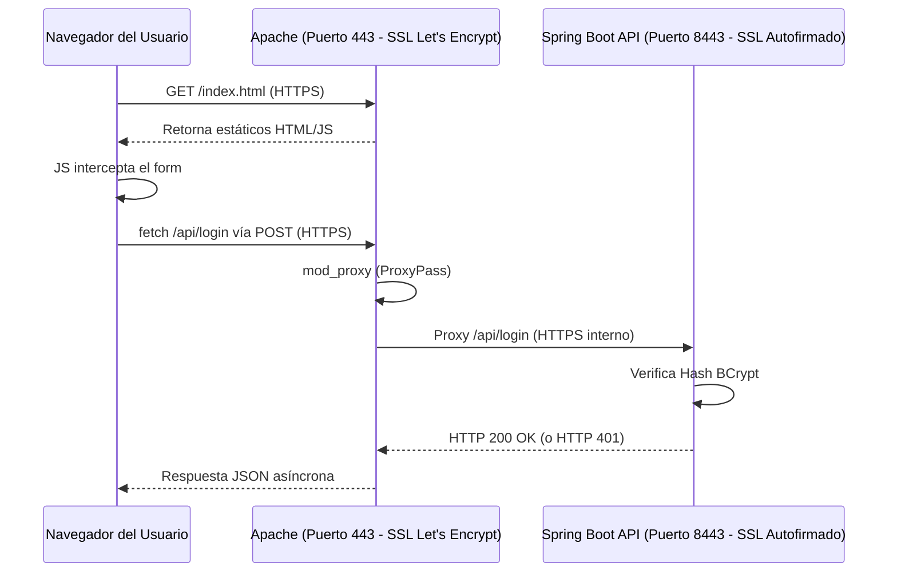

# Application Architecture Design

Este documento detalla la arquitectura de seguridad y despliegue para la aplicación de Autenticación Segura.

## Componentes y Relación

La aplicación sigue una arquitectura asíncrona de 3 niveles:

1. **Cliente HTML + JS Asíncrono**
   - Una interfaz Vanilla JS (`index.html` + `app.js`).
   - El cliente no recarga la página, utiliza la API `fetch` para enviar el intento de Login de forma asíncrona hacia el backend.
   - Las contraseñas viajan seguras porque todo el tráfico del cliente es obligado a transitar por **HTTPS** (Terminal TLS en Apache).

2. **Servidor Web Apache (Reverse Proxy + Let's Encrypt)**
   - Actúa como el único punto de entrada público expuesto al Internet.
   - Se encarga de terminar la conexión TLS oficial mediante un certificado provisto por **Let's Encrypt**.
   - Redirige las peticiones que llegan al path `/api/*` hacia nuestro servidor de Spring Boot usando `mod_proxy`.
   - Sirve los archivos estáticos HTML/JS directamente, mejorando el rendimiento.

3. **Backend de Spring Boot**
   - Expone nuestra API de Autenticación (`/api/login`).
   - Para cumplir el requerimiento de conexión segura entre Apache y Spring, Spring Boot está configurado para correr en el puerto interno `8443` utilizando **TLS con un certificado Autofirmado** tipo PKCS12 (`keystore.p12`).
   - Implementa Spring Security para manejar las validaciones y proteger el endpoint. 
   - Las contraseñas no se almacenan en texto plano; se utiliza **BCrypt** para crear hashes (alojado en un `InMemoryUserDetailsManager` por simplicidad).

## Diagrama de Configuración

## Estrategias de Despliegue Seguro en AWS

Para desplegar esta aplicación de forma segura en AWS (Amazon Web Services), se deben seguir las siguientes consideraciones a nivel de red y servidor:

1. **VPC y EC2:** Se levanta una instancia virtual EC2 (Ej. Ubuntu 22.04 LTS).
2. **AWS Security Groups:** Es el firewall virtual de AWS. Solo debe permitir:
   - **Puerto 80 (HTTP):** Para redirigir tráfico automáticamente a HTTPS y para los desafíos de Certbot.
   - **Puerto 443 (HTTPS):** Abierto a todo el mundo (0.0.0.0/0) para acceder a la aplicación web.
   - **Puerto 22 (SSH):** Idealmente, restringido únicamente a la IP personal del administrador (`Mi IP`).
3. **Restricción Interna:** El puerto `8443` en el cual corre Spring Boot **no** se abre en el Security Group. Spring Boot no es accesible directamente desde internet; solo Apache (que corre internamente en la misma instancia) tiene permitido contactar el puerto 8443 a través de localhost.
4. **Certificados TLS:**
   - La conexión cliente-instancia AWS usa un certificado válido gracias a **Let's Encrypt** y Certbot.
   - La conexión interna Apache-Spring usa el `.p12` local.
